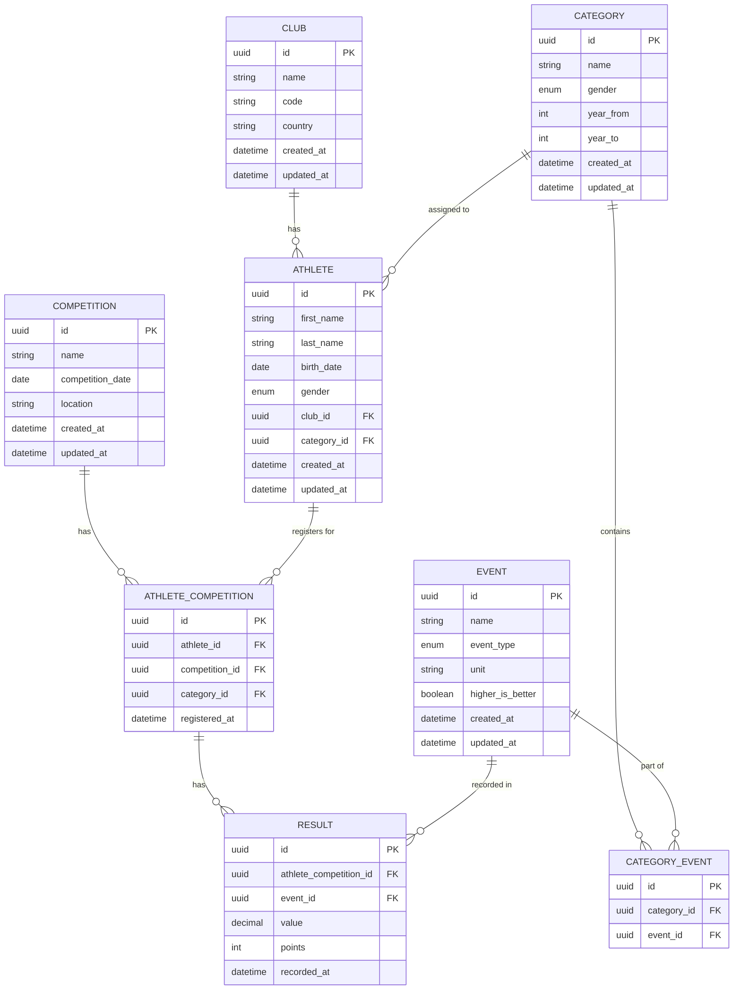

# Entity Model

This document describes the data model for the Track and Field Competition Management System.

## Entity Relationship Diagram

## Entities

### Competition

Track and field competition event.

| Attribute | Type | Description | Constraints |
|-----------|------|-------------|-------------|
| id | UUID | Primary key | Auto-generated |
| name | String | Competition name | Not null, max 255 chars |
| competition_date | Date | Date of the competition | Not null |
| location | String | Location of the competition | Max 255 chars |
| created_at | DateTime | Record creation timestamp | Auto-generated |
| updated_at | DateTime | Last update timestamp | Auto-updated |

---

### Club

Athlete clubs or teams.

| Attribute | Type | Description | Constraints |
|-----------|------|-------------|-------------|
| id | UUID | Primary key | Auto-generated |
| name | String | Club name | Not null, unique, max 255 chars |
| code | String | Short code for the club | Max 10 chars |
| country | String | Country code (ISO 3166-1 alpha-2) | Max 2 chars |
| created_at | DateTime | Record creation timestamp | Auto-generated |
| updated_at | DateTime | Last update timestamp | Auto-updated |

---

### Category

Age and gender categories for athletes.

| Attribute | Type | Description | Constraints |
|-----------|------|-------------|-------------|
| id | UUID | Primary key | Auto-generated |
| name | String | Category name (e.g., "U16 Male") | Not null, max 100 chars |
| gender | Enum | Gender (MALE, FEMALE) | Not null |
| year_from | Integer | Birth year lower bound (inclusive) | Not null |
| year_to | Integer | Birth year upper bound (inclusive) | Not null |
| created_at | DateTime | Record creation timestamp | Auto-generated |
| updated_at | DateTime | Last update timestamp | Auto-updated |

**Business Rule:** Categories are automatically assigned to athletes based on birth year and gender.

---

### Event

Track and field events (e.g., 100m, long jump, shot put).

| Attribute | Type | Description | Constraints |
|-----------|------|-------------|-------------|
| id | UUID | Primary key | Auto-generated |
| name | String | Event name | Not null, max 100 chars |
| event_type | Enum | Type (TRACK or FIELD) | Not null |
| unit | String | Unit of measurement (e.g., "seconds", "meters") | Not null |
| higher_is_better | Boolean | True for distance, false for time | Not null, default false |
| created_at | DateTime | Record creation timestamp | Auto-generated |
| updated_at | DateTime | Last update timestamp | Auto-updated |

---

### CategoryEvent

Junction entity linking categories to their eligible events.

| Attribute | Type | Description | Constraints |
|-----------|------|-------------|-------------|
| id | UUID | Primary key | Auto-generated |
| category_id | UUID | Reference to Category | Not null, foreign key |
| event_id | UUID | Reference to Event | Not null, foreign key |

**Business Rule:** Athletes can only compete in events assigned to their category.

---

### Athlete

Registered athletes.

| Attribute | Type | Description | Constraints |
|-----------|------|-------------|-------------|
| id | UUID | Primary key | Auto-generated |
| first_name | String | Athlete's first name | Not null, max 100 chars |
| last_name | String | Athlete's last name | Not null, max 100 chars |
| birth_date | Date | Athlete's date of birth | Not null |
| gender | Enum | Gender (MALE, FEMALE) | Not null |
| club_id | UUID | Reference to Club | Nullable, foreign key |
| category_id | UUID | Reference to assigned Category | Nullable, foreign key |
| created_at | DateTime | Record creation timestamp | Auto-generated |
| updated_at | DateTime | Last update timestamp | Auto-updated |

**Business Rule:** Category is automatically determined based on birth year and gender.

---

### AthleteCompetition

Registration of athletes in a specific competition.

| Attribute | Type | Description | Constraints |
|-----------|------|-------------|-------------|
| id | UUID | Primary key | Auto-generated |
| athlete_id | UUID | Reference to Athlete | Not null, foreign key |
| competition_id | UUID | Reference to Competition | Not null, foreign key |
| category_id | UUID | Reference to Category used in competition | Not null, foreign key |
| registered_at | DateTime | Registration timestamp | Auto-generated |

---

### Result

Athlete's performance in an event at a competition.

| Attribute | Type | Description | Constraints |
|-----------|------|-------------|-------------|
| id | UUID | Primary key | Auto-generated |
| athlete_competition_id | UUID | Reference to AthleteCompetition | Not null, foreign key |
| event_id | UUID | Reference to Event | Not null, foreign key |
| value | Decimal | Result value (time in seconds or distance in meters) | Not null |
| points | Integer | Calculated points based on IAAF formula | Not null |
| recorded_at | DateTime | When the result was recorded | Auto-generated |

**Business Rule:** Points are calculated according to IAAF (World Athletics) scoring formulas.

---

## Relationships Summary

| Relationship | Cardinality | Description |
|--------------|-------------|-------------|
| Competition → AthleteCompetition | 1:N | A competition has multiple athlete registrations |
| Club → Athlete | 1:N | A club has multiple athletes |
| Category → Athlete | 1:N | A category contains multiple athletes |
| Category → CategoryEvent | 1:N | A category has multiple events assigned |
| Event → CategoryEvent | 1:N | An event can be in multiple categories |
| Athlete → AthleteCompetition | 1:N | An athlete can register for multiple competitions |
| AthleteCompetition → Result | 1:N | An athlete in a competition has multiple results |
| Event → Result | 1:N | An event has multiple results |

## Indexes

| Entity | Fields | Type | Purpose |
|--------|--------|------|---------|
| Athlete | (last_name, first_name) | B-tree | Name-based searches |
| Athlete | (birth_date) | B-tree | Category calculation |
| Athlete | (category_id) | B-tree | Category-based queries |
| Athlete | (club_id) | B-tree | Club-based queries |
| Category | (gender, year_from, year_to) | B-tree | Automatic category assignment |
| Result | (athlete_competition_id) | B-tree | Result lookups |
| Result | (event_id) | B-tree | Event-based result queries |
| AthleteCompetition | (competition_id, category_id) | B-tree | Category-based ranking |
